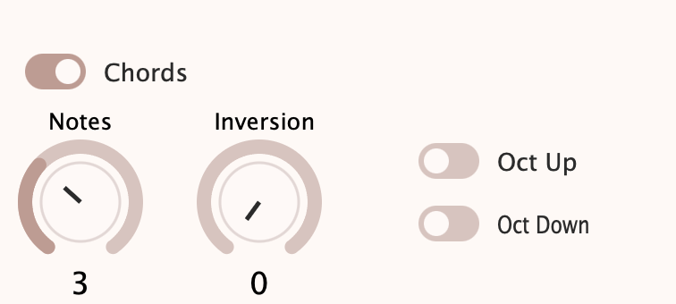
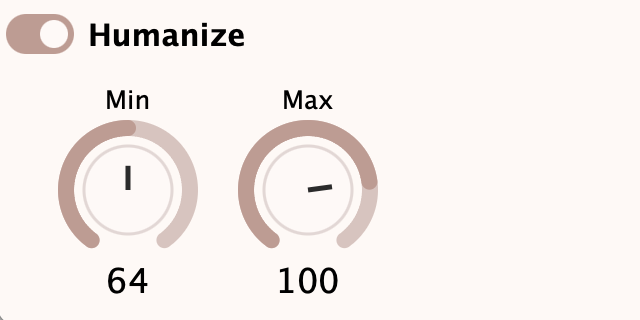

# aiomfx

Aiomfx is a MIDI processing plugin.

## Table of Contents
- [Processors](#processors)
  - [Scales and Chords](#scales-and-chords)
    - [Scales](#scales)
    - [Chords](#chords)
  - [Humanize](#humanize)
- [System Requirements](#system-requirements)

## Processors

### Scales and Chords
Scales and Chords either transposes played notes to fit a selected scale or transposes notes and generates chords from a single note that fit the selected scale. By default both functions are enabled.

#### Scales

This processor will fit one or more played notes into the selected scale. To pick a scale use `Key` and `Scale` dropdowns.

#### Chords

To enable/disable chord generation click the button left to `Chords` label. What chord is generated can be controlled using `Notes` and `Inversions` sliders to set the number of notes in the chord and[...]

When chords generation is active better to play only a single note. Be careful with playing multiple notes simultaneously because each played note will be used to generate chords and therefore it can[...]

### Humanize

Humanize adds randomness to the velocity of played notes. It's useful when you want to make your music sound less robotic. The amount of randomness can be controlled using Min and Max sliders. 

## System Requirements
Any major DAW that can use VST3 or AU plugins (Ableton Live, Cubase, Logic Pro, etc). 

Aiomfx currently is being tested in Ableton Live, REAPER.
